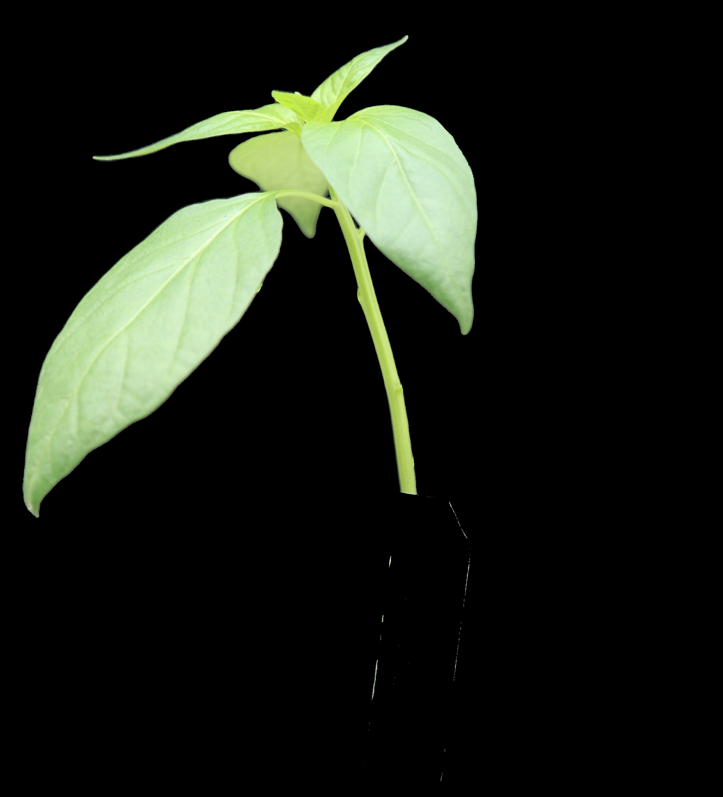

# Chilli Quality Detection

This project provides a Python-based solution to **detect chili (leaf/produce) quality and classify it into Grades 0–4**.  
It uses **deep learning (U²-Net)** for segmentation and applies **image processing techniques (OpenCV + HSV filtering)** to extract quality metrics. Finally, these metrics are mapped into a **grading system**.

---

## 🚀 Features
- **Automatic Segmentation** of chili images using **U²-Net**.
- **Color-based Refinement** (filters green pixels to focus on leaf/chili regions).
- **Quality Metrics Computation**, including:
  - Healthy Green Coverage (HGC%)
  - Yellow/Brown Coverage (YB%)
  - Damage % (via convex hull deficit)
  - Hull Convexity Index (HCI)
  - Foreign Matter % (FM%)
- **Grading System (0–4)** based on computed metrics.
- **Batch Processing** of an entire folder or a single image.
- **Optional Export** of segmented images with grade labels in filenames.
- **Jupyter Notebooks** for testing segmentation and metrics independently.

---

## 📂 Project Structure
```
.
├── main.py              # Main script for chili quality grading
├── u2net.py             # U²-Net model definition (required)
├── u2net.pth            # Pretrained U²-Net weights (download separately)
├── segmentation.ipynb   # Notebook for testing segmentation pipeline
├── metrics.ipynb        # Notebook for testing metrics calculation
└── README.md            # Documentation
```

---

## ⚙️ Installation

1. **Clone the repository / copy code**  
   ```bash
   git clone https://github.com/AbhijeetAnand23/Chilli-Quality-Detection.git
   cd Chilli-Quality-Detection
   ```

2. **Install dependencies**  
   ```bash
    pip install -r requirements.txt
   ```

3. **Download U²-Net model files**  
   - Download the **model definition** [`u2net.py`](https://github.com/xuebinqin/U-2-Net/blob/master/model/u2net.py) from the official U²-Net repository.  
   - Download the **pretrained weights** [`u2net.pth`](https://github.com/xuebinqin/U-2-Net) (or another pretrained source).  
   - Place both `u2net.py` and `u2net.pth` in your project directory (same folder as `main.py`).  


---

## ▶️ Usage

### 1. Run on a single image
```bash
python main.py --image path/to/chili.jpg --model u2net.pth
```

### 2. Run on a folder of images
```bash
python main.py --folder path/to/chili_folder --model u2net.pth
```

### 3. Save segmented outputs with grade labels
```bash
python main.py --folder data/chilis --model u2net.pth --save results/
```
This will generate outputs like:
```
results/
 ├── chili1_grade1.jpg
 ├── chili2_grade3.jpg
 └── chili3_grade2.jpg
```

---

## 🔍 Code Explanation

Your code works in **two stages**:

### **Stage A – Segmentation**
This stage focuses on isolating the chili leaves from the background (and any other objects like pots).  
It involves a pipeline of multiple steps:

1. **Load U²-Net model** (`load_u2net`)  
   - Loads the **pretrained U²-Net segmentation model** from the `u2net.pth` weights file.  
   - If a GPU (CUDA) is available, the model is moved to GPU for faster inference; otherwise, it runs on CPU.  
   - The model is then set to evaluation mode (`net.eval()`), so it won’t update weights and will only perform inference.

2. **Preprocess images** (`preprocess_image`)  
   - Reads the input image using **PIL** and converts it to RGB format.  
   - Resizes the image to a fixed size of **320×320 pixels** so it matches the model’s expected input dimensions.  
   - Normalizes pixel values with mean and standard deviation values (same as ImageNet dataset) to make the model predictions more stable.  
   - Converts the image into a **PyTorch tensor** and adds a batch dimension so it can be fed into the model.

3. **Segment object** (`segment_leaf_u2net`)  
   - Feeds the preprocessed image into the U²-Net model, which generates a **binary mask** indicating the foreground (chili leaf) and background.  
   - The output mask is normalized to values between 0–255 and resized back to the original image size.  
   - This mask is then applied to the original image so only the segmented region (leaf + anything else the model picked up) remains.

4. **Refine with color** (`refine_mask_with_color`)  
   - Since the model may also segment unwanted objects like **pots or background areas**, an additional filtering step is applied.  
   - The refinement step removes those non-leaf areas and ensures that only the **leaf region** is kept for further analysis.  
   - This greatly improves the accuracy of the metrics later on.

5. **Save segmented outputs** (`segment_to_dir`)  
   - After refinement, the segmented leaf image is saved to a **temporary directory** (or a specified output folder).  
   - If a folder is processed, this function iterates through all images, applies segmentation + refinement, and stores all results in one place.  
   - These segmented images are later used in **Stage B (Metrics & Grading)** to calculate leaf quality.  

### **Example: Original vs Segmented Image**

| Original Image | Segmented Image |
|----------------|----------------|
|  |  |

*The left column shows the original leaf image, and the right column shows the output after segmentation and refinement.*
✅ 
---

### **Stage B – Metrics & Grading**

1. **Load segmented images** (`grade_from_segmented`)  
   Reads the saved segmented chili images.  

2. **Compute metrics** (`compute_leaf_metrics`)  
   - **HGC%** = Healthy Green Coverage; ratio of green pixels in the leaf.  
   - **YB%** = Yellow + Brown Coverage; ratio of yellow and brown pixels.  
   - **DMG%** = Damage percentage; calculated as the convex hull area deficit.  
   - **HCI** = Hull Convexity Index; leaf area divided by convex hull area (shape health).  
   - **FM%** = Foreign Matter percentage; pixels in the leaf mask not belonging to green or yellow/brown regions.  

3. **Map metrics to grade** (`metric_to_grade`)  
   - Converts metrics to discrete grades (0–4, with 0 = best, 4 = worst) using defined thresholds:  
     - **HGC%**: higher values → better grade.  
     - **YB%**, **DMG%**, **FM%**: lower values → better grade.  
     - **HCI**: higher values → better grade.  
   - Final grade is computed as **minimum** of all individual metric grades to represent worst-case quality.  
   - Prints each metric’s individual grade for traceability.  

4. **Output Results**  
   - Prints metrics and final grade for each chili image.  
   - Optionally saves images with grade in the filename.


---
## 🧮 Grading Logic

- **Grade 0 (Best):** Healthy Green Coverage (HGC%) ≥ 95%, Yellow/Brown (YB%) ≤ 1%, Damage (DMG%) ≤ 0.5%, Hull Convexity Index (HCI) ≥ 0.97, Foreign Matter (FM%) ≤ 0.2%.  
- **Grade 1:** HGC% 90–94%, YB% 1–3%, DMG% 0.5–2%, HCI 0.95–0.96, FM% 0.2–0.5%.  
- **Grade 2:** HGC% 80–89%, YB% 3–7%, DMG% 2–5%, HCI 0.92–0.94, FM% 0.5–1%.  
- **Grade 3:** HGC% 60–79%, YB% 7–15%, DMG% 5–10%, HCI 0.88–0.91, FM% 1–2%.  
- **Grade 4 (Worst):** HGC% < 60%, YB% > 15%, DMG% > 10%, HCI < 0.88, FM% > 2%.  

> **Note:** The lowest grade among all individual metrics is finally assigned to the leaf as its overall grade.

---


## 📊 Example Output
```bash
chili1.jpg => Grade: 1, Metrics: {'HGC%': 96.2, 'YB%': 0.5, 'DMG%': 0.4, 'HCI': 0.98, 'FM%': 0.1}
chili2.jpg => Grade: 3, Metrics: {'HGC%': 65.7, 'YB%': 12.3, 'DMG%': 6.1, 'HCI': 0.89, 'FM%': 2.0}
```
---
